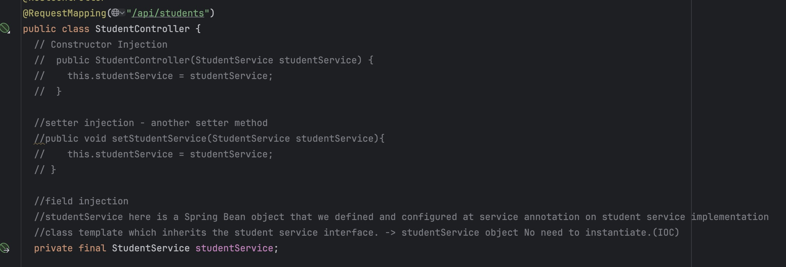

### Homework9

#### a. What is Spring IoC? 
Inversion of Control is a principle where Spring takes over the responsibility of creating and managing Spring Bean objects, instead of you doing it manually with new. It is loose coupling. Instead of a class creating its own dependency with new, it receives it via dependency injection, making it easy to swap implementations without modifying the class.
 
#### b. What is an IoC Container? 
The IoC Container reads your configuration, creates all the beans, wires their dependencies together, and manages their lifecycle from startup to shut down. 
Think of it as a smart factory that knows how to build and connect every part of your application. ApplicationContext is the most used container in Spring Boot.
 
#### c. Advantages of IoC 
IoC makes your classes loose coupling, meaning you can swap out implementations without touching the classes that depend on them. MVC Split logic to three major pieces. If there are multiple Controllers, Services, and Repositories, it can easily replace. 
It also makes unit testing much easier since you can inject mock objects instead of real dependencies. 
Also, Spring handles object lifecycle automatically, so you don't need to worry about creating or destroying objects manually.

 
#### d. What is Dependency Injection (DI)? 
Dependency Injection is the actual technique Spring uses to implement IoC — instead of a class creating its own dependencies, Spring pushes them in from the outside. 

There are three ways Spring can inject dependencies into your class. 
o	Constructor injection passes dependencies through the constructor
o	Setter injection uses setter methods.
o	Field injection injects directly into the field using @Autowired. 
Ex: if OrderService needs PaymentService, Spring creates PaymentService and hands it to OrderService automatically. This means your classes never need to know how their dependencies are created.
 
#### e. Demo Code to show what is Dependency Injection (give screenshot).

 
#### f. Types of Dependency Injection 
There are three ways Spring can inject dependencies. All three achieve the same result but differ in how and when the dependency is provided.
o	Constructor injection passes dependencies through the constructor
o	Setter injection uses setter methods.
o	Field injection injects directly into the field using @Autowired. 

 
#### g. Pros and Cons of Each Type of dependency Injection
Constructor injection is the recommended approach because dependencies are immutable (final) and always guaranteed to be set, making the class easy to test. 
Setter injection is useful for optional dependencies but leaves the door open for missing or changed values at runtime. 
Field injection looks clean but is the worst choice for testability since you can't inject mocks without a Spring context.
 
#### h. @Component vs @Bean 
@Component is placed on your own class and lets Spring auto-detect and register it as a bean during component scanning. 
@Bean is placed on a method inside a @Configuration class and is used when you need to manually control how an object is created — especially for third-party classes you can't annotate yourself. 
Use @Component for your own code and @Bean when you need custom creation logic or don't own the class.
 
#### i.	@Configuration and @ComponentScan 
@Configuration for manual beans and @ComponentScan for auto-discovered ones.
@Configuration marks a class as a place where you manually define beans using @Bean methods, telling Spring this class sets up the application context. 
@ComponentScan tells Spring which packages to search through to find classes annotated with @Component, @Service, @Repository. 
 
#### j. @Controller vs @RestController 
@Controller returns a view, @RestController returns data.
@Controller is used in traditional MVC web apps where methods return the name of a view (like an HTML template) to be rendered. 
@RestController is used for REST APIs and automatically serializes return values to JSON, combining @Controller and @ResponseBody in one annotation. 
 
#### k. @Controller vs @Service vs @Repository 
All three are specializations of @Component and register the class as a Spring bean, but they signal different architectural layers. 
@Controller belongs in the web layer handling HTTP requests
@Service belongs in the business logic layer.
@Repository belongs in the data access layer. It also has the extra behavior of automatically translating database exceptions into Spring's unified DataAccessException.
 
#### l. Spring Bean Scope 
Bean scope controls how many instances of a bean Spring creates and how long each instance lives. 
Ex: Singleton gives you one shared instance for the whole app. Prototype gives a new instance every time you request it. 
Web-aware scopes like request and session tie the bean's lifetime to an HTTP request or user session respectively.
 
#### m. Singleton vs Prototype 
A singleton bean is created once and shared across the entire application.
Ex: every class that injects it gets the same object. 
A prototype bean creates a brand-new instance every single time it is requested from the container. 
Use singleton for stateless services and prototype when each caller needs its own independent, stateful object.
 
#### n. Use Cases or each of singleton, prototype, request and session bean scope
Singleton — A UserService handling business logic, a DataSource managing the DB connection pool, and an AppConfig bean loading properties once at startup. 
Prototype — An email builder composing a unique message per invocation, a report generator accumulating its own state, and a shopping cart object for an isolated user interaction. 
Request — Storing the authenticated user's info for one HTTP request, accumulating log entries per request, and holding form submission data during validation. 
Session — Persisting a logged-in user's language/theme preferences, keeping a shopping cart alive while the user browses, and tracking progress through a multi-step form wizard.
 
#### o. Session vs Cookie 
A cookie is stored on the client (browser) and sent with every request — it's lightweight but size-limited (~4KB) and visible to the user, making it less secure for sensitive data. 
A session is stored on the server and identified by a session ID that Spring sends to the browser as a cookie, keeping the actual data safe server-side. 
Use cookies for harmless preferences like theme or language, and sessions for sensitive data like login state.

